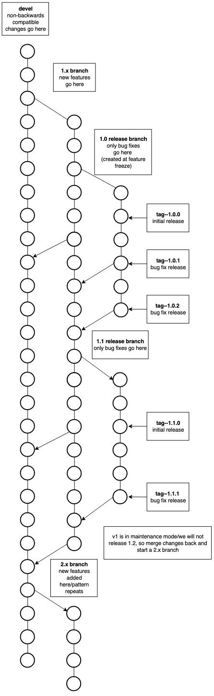

Versioning
++++++++++

FleCSI uses the `Semantic Versioning`__ system.
Note that it defines the three kinds of releases in terms of *restrictions* on what changes can appear in each, and that those restrictions are phrased in terms of the documented interface.
We interpret compatibility strictly in terms of source (with the inevitable judgment calls for things like SFINAE).
Even altogether new code can appear in a "patch" release if it serves to fix a bug or improve performance rather than as a new documented feature.
As an exception to the specification, deprecations can be made in such a release as well, since they are merely documentation for the careful user who wants to upgrade early for forward compatibility.
However, since features are typically deprecated in favor of some new feature, most will nonetheless appear in feature releases.

__ https://semver.org/

There is one active, shared branch for each of the three types of release, as described below.
Tags are used to identify releases as well as certain internal reference points for development.

Branch Types
^^^^^^^^^^^^

incompatible
  The *develop* branch is where work on the next major release takes
  place, potentially with interface and feature changes that are
  *incompatible* with previous versions.

feature
  Feature branches (named for their *major* version number, e.g., 1, 2,
  3) are for feature development on the current major version.

release
  Release branches (named for their *major.minor* version number, e.g.,
  1.1, 1.2) are interface-stable versions of the code base.
  At appropriate points, tags (named for their
  *major.minor.patch* version number, e.g., 1.1.2) are used to identify
  patched versions.

.. _branch:

  Workflow diagram illustrating basic workflow using the three branch
  types described above. (Figure due to Angela Herring.)

In general, each change should be made on the most restrictive permissible relevant branch so as to minimize divergence between them (after merging) and the associated potential for future merge conflicts.
The condition of relevance pertains to an internal feature that might be added only on the feature branch if it is not expected to accrue any clients on the release branch.
A sometimes countervailing consideration is stability: users expect that patch releases are less likely to cause problems when upgrading even though it is simply a bug if even a feature release does so.
It is also unfortunate to need to consider reverting a change because an official release is needed in the interval between introducing it and becoming confident in it.

FleCSI Version File (``.version``) and ``FLECSI_VERSION``
^^^^^^^^^^^^^^^^^^^^^^^^^^^^^^^^^^^^^^^^^^^^^^^^^^^^^^^^^

The contents of the ``.version`` file in the root of a FleCSI source
checkout is used to identify the branch type and version of
FleCSI. Given the three different branch types and tagged versioned
releases, its content will be one of the following four schemes:

develop branch
  ``develop``

feature branch
  ``f<major>``

release branch
  ``r<major>.<minor>``

tagged release
  ``v<major>.<minor>.<patch>``

FleCSI uses the information in ``.version`` to define
``FLECSI_VERSION`` in its ``flecsi/config.hh`` header. This constant
encodes the major, minor and patch version of FleCSI in a single
integer value.

For **tagged releases** (``v<major>.<minor>.<patch>``) it is defined
as ``(major << 16) | (minor << 8) | patch``.

On **release branches** both major and minor version components are
set to the release version, however, the patch version component is set
to its maximal value 255.

On **feature branches** only the major version component is set to the
version value, while the minor version component is set to its maximum
255 and the patch version component is set to 0.

Finally, on the **develop branch**, the major version component is set
to its maximum 255, while the other components are set
to 0.

The following table summarizes these rules with some examples:

.. list-table:: Examples of ``.version`` and ``FLECSI_VERSION``
   :header-rows: 1

   * - Source
     - Contents of ``.version``
     - ``FLECSI_VERSION``
   * - ``develop`` branch
     - ``develop``
     - ``0xff0000``
   * - ``2`` feature branch
     - ``f2``
     - ``0x02ff00``
   * - ``2.1`` release branch
     - ``r2.1``
     - ``0x0201ff``
   * - ``v2.2.0`` tagged release
     - ``v2.2.0``
     - ``0x020200``
