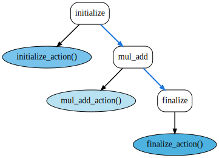

.. |br| raw:: html

    

DAXPY
*****

This example presents a simple but complete example of a FleCSI
program that manipulates a distributed data structure.  Specifically,
the program uses FleCSI to perform a parallel `DAXPY
<http://www.netlib.org/lapack/explore-html/de/da4/group__double__blas__level1_ga8f99d6a644d3396aa32db472e0cfc91c.html>`_
(double-precision *a*\ ⋅\ *X* + *Y*) vector operation.  The sequential
C++ code looks like this:

.. code:: C++

    for (int i = 0; i < N; ++i)
      y[i] += a*x[i];

To further demonstrate FleCSI capabilities and typical program
structure we will also allocate and initialize the distributed vectors
before the DAXPY operation and report the sum of all elements in *Y*
at the end, as in the following sequential code:

.. code:: C++

    // Allocate and initialize the two vectors.
    std::vector<double> x(N), y(N);
    for (size_t i = 0; i < N; ++i) {
      x[i] = static_cast<double>(i);
      y[i] = 0.0;
    }

    // Perform the DAXPY operation.
    const double a = 12.34;
    for (size_t i = 0; i < N; ++i)
      y[i] += a*x[i];

    // Report the sum over y.
    double sum = 0.0;
    for (size_t i = 0; i < N; ++i)
      sum += y[i];
    std::cout << "The sum over all elements in the final vector is " << sum << std::endl;

In the above we arbitrarily initialize *X*\ [*i*] ← *i* and *Y*\ [*i*]
← 0.

For pedagogical purposes the FleCSI version of the above, which we'll
call "FLAXPY", is expressed slightly differently from how a full
application would more naturally be implemented:

* FLAXPY is presented as a single file rather than as separate (and
  typically multiple) source and header files.

* C++ namespaces are referenced explicitly rather than imported with
  ``using``.

* Some function, method, and variable names are more verbose than they
  would commonly be.

Preliminaries
+++++++++++++

Here's a simple ``CMakeLists.txt`` file for building FLAXPY:

.. literalinclude:: ../../../../tutorial/standalone/flaxpy/CMakeLists.txt
   :language: cpp
   :lines: 6-15

FLAXPY is implemented as a single file, ``flaxpy.cc``.  We begin by
including the header files needed to access the data model, execution
model, and other FleCSI components:

.. literalinclude:: ../../../../tutorial/standalone/flaxpy/flaxpy.cc
   :language: cpp
   :lines: 6-10

For user convenience, we define a ``--length`` (abbreviation: ``-l``)
command-line option for specifying the length of vectors *X* and *Y*
and with a default of 1,000,000 elements.  To do so we declare a
variable of type ``flecsi::program_option``, templated on the option
type, which in this case is ``std::size_t``.  We name the variable
``vector_length`` and define it within a ``flaxpy`` namespace, which
other source files—of which there are none in this simple
example—could import.  ``vector_length`` will be used at run time to
access the vector length.

.. literalinclude:: ../../../../tutorial/standalone/flaxpy/flaxpy.cc
   :language: cpp
   :lines: 12-21

Data structures
+++++++++++++++

FleCSI does not provide ready-to-use, distributed data-structure types.
Rather, it provides "proto data-structure types" called *core topologies*.
These require additional compile-time information, such as the number
of dimensions of a multidimensional array, and additional run-time
information, such as how to distribute their data, to form a concrete
data structure.  Applications are expected to define *specializations*
to provide all of this information.

FLAXPY is based on the ``user`` core topology, so named because it is
arguably the simplest core topology that behaves as a user would expect.
It is essentially a 1-D vector of user-defined *fields* with
no support for ghost cells.
All core topologies specify a ``coloring`` type, which represents
additional run-time data the topology needs
to produce a concrete data structure.
A specialization must define a ``color`` member function that
accepts whatever parameters make sense for that specialization
and returns a ``coloring``.
The ``user`` core topology defines its ``coloring`` type as
a ``std::vector<std::size_t>`` that represents
the number of vector indices to assign to each *color*.
(A color is a unit of data upon which a point task operates.)
``user`` does not require that the specialization provide
any compile-time information,
but most other core topologies do.

For FLAXPY we divide the indices as equally as possible among colors.
The following helper function, still within the ``flaxpy`` namespace,
handles mapping ``vector_length`` number of indices (see
`Preliminaries`_ above) onto a given number of colors:

.. literalinclude:: ../../../../tutorial/standalone/flaxpy/flaxpy.cc
   :language: cpp
   :lines: 25-36

Given that helper function, constructing a specialization of ``user``
is trivial.  FLAXPY names its specialization (still within the
``flaxpy`` namespace) ``dist_vector``:

.. literalinclude:: ../../../../tutorial/standalone/flaxpy/flaxpy.cc
   :language: cpp
   :lines: 40-47

Note that the specialization is responsible for choosing the number of
colors.  ``dist_vector``'s ``color`` method queries FleCSI for the
number of processes and uses that value for the color count.

At this point we have what is effectively a distributed 1-D vector
data type that is templated over the element type.  The next step is
to specify the element type.  In FleCSI, each element of a data
structure comprises one or more *fields*.  One can think of fields as
named columns in a tabular representation of data.  FLAXPY adds two
fields of type ``double``: ``x_field`` and ``y_field``.  These are
added outside of the ``flaxpy`` namespace, in an anonymous namespace.
``flaxpy.cc`` uses this anonymous namespace to indicate that its
contents are meaningful only locally and not needed by the rest of the
application.

.. literalinclude:: ../../../../tutorial/standalone/flaxpy/flaxpy.cc
   :language: cpp
   :lines: 86-87,90-95

``one_field`` is defined in the above to save typing,
both here and in task definitions
(see `Tasks`_ below).

Specializations typically require run-time information to produce a
usable object.  This information may not be available until a number
of libraries (FleCSI, Legion, MPI, and the like) have initialized and
perhaps synchronized across a distributed system.  To prevent
applications from directly constructing an object of a specialization
type and accessing this object before library initialization and
synchronization have completed, FleCSI imposes a particular means of
instantiating a specialization based on what it calls *slots*.  The
following lines of code declare the (topology) *slot* and *coloring slot* that
will be used within FLAXPY's initialization action (see `Actions`_
below) to allocate distributed storage for the application's
distributed vector:

.. literalinclude:: ../../../../tutorial/standalone/flaxpy/flaxpy.cc
   :language: cpp
   :lines: 98-99

Control flow
++++++++++++

Recall from the :doc:`control` section that
a FleCSI application's control flow is defined in terms of a
*control point*—*action*—*task* hierarchy.
FLAXPY's overall control flow is illustrated in :numref:`flaxpy_control`.
`Control points`_ are drawn as white rounded rectangles;
`actions <Actions_>`_ are drawn as blue ellipses;
and `tasks <Tasks_>`_ are drawn as green rectangles.
As indicated by the figure, FLAXPY is a simple application
and uses a trivial sequence of control points (no looping),
trivial DAGs of actions (comprising a single node apiece),
and trivial task launches (only one per action).

.. _flaxpy_control:

   FLAXPY control model

The bulk of this section is presented in top-down fashion.
That is, function invocations are presented
in advance of the functions themselves.
With the exception of the code appearing in the `Control points`_ section,
all of the control-flow code listed below appears in an anonymous namespace,
again, to indicate that it is meaningful only locally
and not needed by the rest of the application.

Control points
--------------

FLAXPY defines three control points: ``initialize``, ``mul_add``, and
``finalize``.  These are introduced via an enumerated type, which
FLAXPY calls ``cp`` and defines within the ``flaxpy`` namespace:

.. literalinclude:: ../../../../tutorial/standalone/flaxpy/flaxpy.cc
   :language: cpp
   :lines: 50

FleCSI expects to be able to convert a ``cp`` to a string by
dereferencing it.  This requires overloading the ``*`` operator as
follows, still within the ``flaxpy`` namespace:

.. literalinclude:: ../../../../tutorial/standalone/flaxpy/flaxpy.cc
   :language: cpp
   :lines: 56-67

Once an application defines its control points
it specifies a sequential order for them to execute.
(The equivalent of a ``while`` loop
can be expressed with ``flecsi::control_base::cycle``,
and loops can be nested.)
FLAXPY indicates with the following code that
``initialize`` runs first,
then ``mul_add``,
and lastly ``finalize``:

.. literalinclude:: ../../../../tutorial/standalone/flaxpy/flaxpy.cc
   :language: cpp
   :lines: 71-77

The preceding ``control_policy`` class is used to define a fully
qualified control type that implements the control policy:

.. literalinclude:: ../../../../tutorial/standalone/flaxpy/flaxpy.cc
   :language: cpp
   :lines: 79

Actions
-------

Actions, implemented as C++ functions, are associated with control
points.  The following code associates the ``initialize_action``
action with the ``initialize`` control point, the ``mul_add_action``
action with the ``mul_add`` control point, and the
``finalize_action`` action with the ``finalize`` control point:

.. literalinclude:: ../../../../tutorial/standalone/flaxpy/flaxpy.cc
   :language: cpp
   :lines: 182-184

The variables declared by the preceding code (``init``, ``ma``, and
``fin``) are never used.  They exist only for the side effects induced
by instantiating a ``flaxpy::control::action``.

The ``initialize_action`` action uses the slot and coloring slot
defined above in `Data structures`_
to allocate memory for the ``dist_vector`` specialization.
Once this memory is allocated,
the action launches an ``initialize_vectors_task`` task,
granting each constituent point task access to a subset of *X* and *Y*
via the ``x_field`` and ``y_field`` fields declared in `Data structures`_.

.. literalinclude:: ../../../../tutorial/standalone/flaxpy/flaxpy.cc
   :language: cpp
   :lines: 124-131

The ``mul_add_action`` action spawns ``mul_add_task`` tasks,
passing then a scalar constant *a* directly and access to a subset of
*X* and *Y* via ``x_field`` and ``y_field``:

.. literalinclude:: ../../../../tutorial/standalone/flaxpy/flaxpy.cc
   :language: cpp
   :lines: 143-148

The third and final action, ``finalize_action``, sums the elements
of *Y* by initiating a global reduction.  Because they represent a
global reduction, the ``reduce_y_task`` tasks are spawned using
``flecsi::reduce`` instead of ``flecsi::execute`` as in the preceding
two actions.  ``finalize_action`` uses the FleCSI logging facility,
FLOG, to output the sum.  Finally, the function deallocates the memory
previously allocated by ``initialize_action``.

.. literalinclude:: ../../../../tutorial/standalone/flaxpy/flaxpy.cc
   :language: cpp
   :lines: 165-174

Tasks
-----

Tasks are functions that collectively and (usually) concurrently
process a distributed data structure.
``flecsi::execute``, as seen in the preceding section,
spawns one point task per color.
Each point task is individually responsible for processing a subspace
(or "color") of the distributed data structure.
Because FleCSI follows `Legion <https://legion.stanford.edu/>`_'s data
and concurrency model,
a point task is provided access to a subspace
via an *accessor* templated on an access right:
``ro`` (read only),
``wo`` (write only),
``rw`` (read/write), or
``na`` (no access).

The ``initialize_vectors_task`` task requests
write-only access to subspaces of *X* and *Y*
because write-only access is necessary to initialize a field.
The task uses ``divide_indices_among_colors``,
defined above in `Data structures`_,
to compute the number of vector indices to which a point task has access
and the global index corresponding to local index 0.
Once these are known, the task initializes
*X*\ [*i*] ← *i* and *Y*\ [*i*] ← 0
over its subset of the distributed *X* and *Y* vectors.
FLAXPY uses FleCSI's ``forall`` macro to locally parallelize
(e.g., using thread parallelism)
the initialization of *Y*.

.. literalinclude:: ../../../../tutorial/standalone/flaxpy/flaxpy.cc
   :language: cpp
   :lines: 102-121

``mul_add_task`` is the simplest of FLAXPY's three tasks
but also the one that performs the core DAXPY computation.
It accepts a scalar *a* and requests read-only access to a subspace of *X*
and read/write access to a subspace of *Y*.
The task then computes
*Y*\ [*i*] ← *a*\ ⋅\ *X*\ [*i*] + *Y*\ [*i*]
over its subset of the distributed *X* and *Y* vectors.

.. literalinclude:: ../../../../tutorial/standalone/flaxpy/flaxpy.cc
   :language: cpp
   :lines: 133-140

The third and final task, ``reduce_y_task``,
computes and returns the sum of a subspace of *Y*.
For this it requests read/write access to the subspace
and uses FleCSI's ``reduceall`` macro to locally parallelize
(e.g., using thread parallelism)
the summation.

.. literalinclude:: ../../../../tutorial/standalone/flaxpy/flaxpy.cc
   :language: cpp
   :lines: 151-162

Program initialization
++++++++++++++++++++++

FLAXPY's ``main`` function, expressed outside of any namespace, is
largely boilerplate.  It initializes FleCSI, executes the FLAXPY code
according to the control flow defined above in `Control flow`_, and
finalizes FleCSI.

.. literalinclude:: ../../../../tutorial/standalone/flaxpy/flaxpy.cc
   :language: cpp
   :lines: 185-201

Usage
+++++

FLAXPY can be built and run as follows:

.. code:: bash

    cd tutorial/standalone/flaxpy
    mkdir build
    cd build
    cmake ..
    make -j
    mpiexec -n 8 ./flaxpy

Depending on your installation, you may need to execute ``mpirun``,
``srun``, or another launcher instead of ``mpiexec``.  The ``-n 8``
specifies 8-way process parallelism.  The output should look like
this:

.. code:: none

    The sum over all elements in the final vector is 6.16999e+12

Try

* passing ``--help`` to ``flaxpy`` to view the supported command-line
  options,

* passing ``--length=2000000`` to ``flaxpy`` to run DAXPY on a vector
  that is twice as long as the default,

* running with a different amount of process parallelism, perhaps
  across multiple nodes in a cluster, or

* [**advanced**] modifying ``flaxpy.cc`` to construct a specialization
  of ``narray`` (a multidimensional-array core topology) instead of a
  specialization of ``user``.  See the source code to the
  :doc:`Poisson example <poisson>`, in particular
  ``tutorial/standalone/poisson/include/specialization/mesh.hh``, for
  an example of the use of ``narray``.
