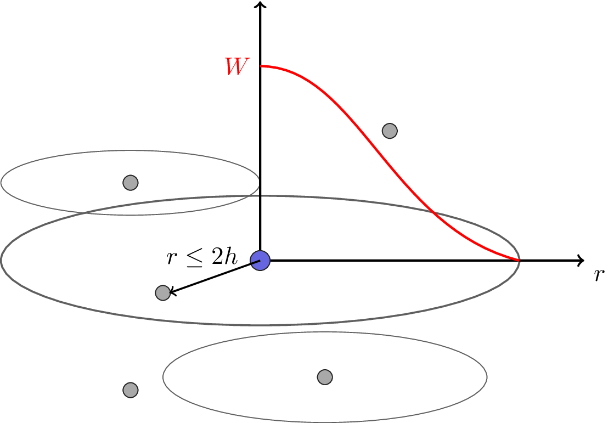
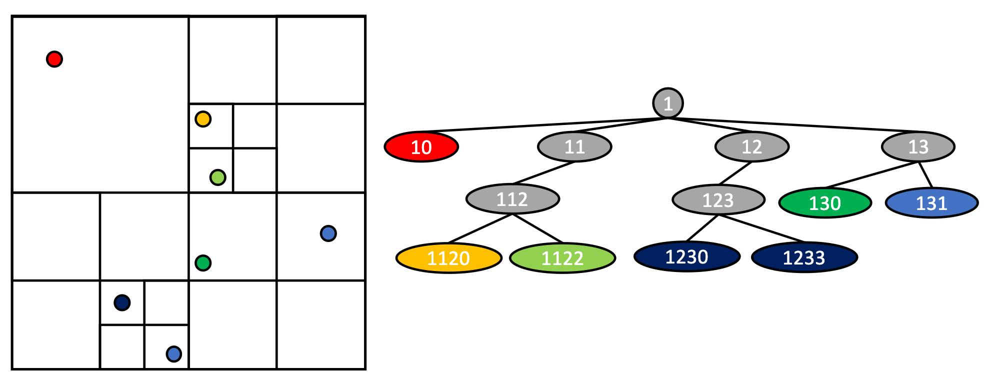

.. |br| raw:: html

    

N-Tree
******

This tutorial features a simple hydrodynamics code based on Smoothed Particle Hydrodynamics (SPH) applied to a classic hydrodynamics problem called the Sod shock tube. Through this example, it presents the different capabilities and interface of the N-Tree topology.

SPH sodtube
===========

SPH is a meshfree method that uses particles to represent units of mass in space.
Each particle interacts with neighboring particles using a `smoothing length` (``h``) and a function called a `kernel` (``W``), the following figure illustrates this concept of `area of influence`.

.. _general_sph:

  Smoothed Particle Hydrodynamics particle interaction.

In order to represent this system of particles and to efficiently find neighboring particles, the best implementations are based on a tree data structure.
Each particle is assigned a unique key using space-filling curves such as Morton or Hilbert ordering.
These keys are then used to create the tree data structure while keeping data locality for efficient neighbor computation.

.. _quadtree:

  Two dimensional N-Tree construction based on keys using Morton ordering.
  On the left figure we can see that the space is divided in quadrants (for two dimensions). If multiple particles are in the same quadrant, we divide it in four, using the Morton ordering (also called the Z-order). These quadrants are labeled `0`, `1`, `2`, and `3` for the `top left`, `top right`, `bottom left`, and `bottom right` respectively (forming a "Z" shape in space). Each time a quadrant is divided, these indices are concatenated to form a ``key``. We can find the same decomposition in the N-Tree on the right figure.

The implementation is based on four files:

- ``ntree_sph.hh``: The SPH specialization of the N-Tree. It will be used to illustrate the different tree traversals methods.
- ``main.cc``: The Sod shock tube implementation, creates the N-Tree and uses tasks to evolve the simulation.
- ``sph_physics.hh``: Provides the physics used in the tasks of ``main.cc``.
- ``control.hh``: The different control points to run the example.

In this document we will refer to the leaves of the N-Tree as ``entities``. In this example the ``entities`` will represent the `particles` in SPH. The other components of the tree are called nodes and are a separate index space.
The ``keys`` will refer to the space-filling curve values associated with the ``entities`` and ``nodes``.

We will first focus on the ``main.cc`` file which implements the Sod shock tube, using the specialization described later. We will not detail all the tasks and the physics involved, but this will give us an opportunity to explore the capabilities of the N-Tree.

Control Model
-------------

This example uses the FleCSI control model with four actions:

- ``initialize_action``: Generates the N-Tree topology and populates the different fields with initial data.
- ``iterate_action``: This cycle in the control model loops over the physics functions to compute the Sod shock tube interactions.
- ``output_action``: This action outputs information about the simulation to text files, per iteration and per color. It is part of the cycle.
- ``finalize_action``: This action assembles each iteration information from all colors into one text file per iteration on color 0.

The control model can be represented as:

.. _sph_control_model:
.. figure:: images/sph-control-model.svg
  :align: center
  :width: 70%

  The control model for the N-Tree tutorial.

N-Tree Setup and Fields
-----------------------

The N-Tree setup happens in ``initialize_action``:

.. literalinclude:: ../../../../tutorial/6-topology/ntree.cc
  :language: cpp
  :start-at: std::vector<sph_ntree_t::ent_t> ents;
  :end-at: cp.sph_ntree.allocate(coloring, ents);

Firstly, the initial information about the entities is retrieved (either from a file or directly generated in the program) through a vector of entities. In this example we are using a vector of ``sph_ntree_t::ent_t`` which contains only the vital information to create the N-Tree through our SPH specialization: coordinates, mass, and radius.
The coloring ``sph_ntree_t::mpi_coloring`` is constructed internally via the ``color`` function from the specialization. It defines how the particles are distributed among all the colors. In this example the specialization just provides a simple load-balancing scheme with an equal number of entities per color.
The call to ``allocate`` generates the N-Tree data structure using the information gathered in the vector. After this call, the topology is ready to be used: the tree is built and can be used to find neighboring entities.

The last part of ``initialize_action`` is using a user-provided task to populate the different user-defined fields. These fields are defined at the top of the ``main.cc`` file:

.. literalinclude:: ../../../../tutorial/6-topology/ntree.cc
  :language: cpp
  :start-at: const field<double>::definition<sph_ntree_t> density, pressure, energy,
  :end-at: const field<bool>::definition<sph_ntree_t> is_wall;

The fields are added to the collection of fields that are already provided on the ``entities`` index space by the N-Tree topology and populated in the specialization:

- ``e_keys``: entities keys
- ``e_colors``: entities colors
- ``e_i``: entities interactions
- ``n_i``: nodes interactions

These specific fields, tied to the N-Tree topology and vital for its operation, can be accessed through the topology accessor.
The task ``init_sodtube_task`` shows the access to both this topology accessor and the accessors to the different fields added by the user. We are passing all the fields to a function handled by the physics part of the tutorial in the file ``sph_physics.hh`` called via ``sph::init_physics``.

.. literalinclude:: ../../../../tutorial/6-topology/ntree.cc
  :language: cpp
  :start-at: // init_sodtube_task
  :end-at: } // init_sodtube_task

The entities can then be looped over to initialize their data.
This is presented in the next subsection, demonstrating different access patterns.

Entities/Nodes Access
---------------------

The N-Tree features several ways to access entities/nodes and their neighbors. The different access methods are:

- ``t.entities()``: Returns a list of local entities. This function can be templated on the kind of entities to loop over:

    - ``t.entities<exclusive>``: Default behavior, loops over local entities.
    - ``t.entities<ghost>``: Loops over all ghost entities.
    - ``t.entities<>``: Loops over all entities, ghosts and locals.

- ``t.entities(node_index)``: Returns all the entities (ghosts and locals) under a specific node.
- ``t.neighbors(entity_index)``: Performs a tree traversal, using the iteration methods featured in the specialization, to return a list of the neighboring entities of the ``entity_index`` entity. This list can contain indices of both ghost and local entities.
- ``t.nodes()``: Returns a list of local nodes. The behavior for the templated version is the same as ``t.entities<>()`` but for nodes.
- ``t.nodes(node_index)``: Returns a list of nodes under a specified node index.

These different methods are illustrated in the different tasks/functions present inside the ``sph_physics.hh`` file. A good example is the computation of the density:

.. literalinclude:: ../../../../tutorial/6-topology/sph_physics.hh
  :language: cpp
  :start-at: // Compute density
  :end-at: } // density

The user is looping over all the local entities with ``t.entities()`` and, for each entity ``e``, loops over all the neighbors of this entity with ``t.neighbors(e)``.

Another set of accessors are available for the N-Tree and are used inside the specialization (file ``ntree_sph.h``). We will explore the specialization in the next part, intended for specialization developers.
These other accessors allow the user to perform different kind of tree traversals, used in the ``compute_centroid`` function as ``t.dfs<ttype_t::reverse_preorder, local>()``.
The N-Tree interface features two kinds of traversals: depth-first search (DFS) and breadth-first search (BFS). The DFS is decomposed into four possible traversals: pre-ordered, post-ordered, reverse pre-ordered, and reverse post-ordered.

The user can then ask to access the entities for each node with the other accessors presented above: ``t.entities(n_idx)`` with ``n_idx`` the current node.

Specialization
==============

The specialization is presented in the structure ``sph_ntree_t`` in the file ``ntree_sph.hh``.
This part is out of the scope of what is needed for a user and is dedicated to specialization developers.
This N-Tree specialization for SPH specifies the mandatory options of the N-tree:

.. literalinclude:: ../../../../tutorial/6-topology/ntree_sph.hh
  :language: cpp
  :start-at: //-------------------- Base policy inputs --------------------- //
  :end-before: using index_space = base::index_space;

The most important point in these options is the ``key_t`` structure. This is the space-filling curve that is used to build the N-Tree structure and distribute the entities while keeping them locally close. The space-filling curves values are called `keys` in this tutorial.
FleCSI provides two different space-filling curves: Morton (Z-Order) and Hilbert ordering.

Interactions
------------

One of the features of the N-Tree is to compute neighboring entities. To compute the interaction list, the user needs to provide the data-structure used for this computation and the associated functions.

To compute the interactions, the user provides the data structure with the minimum information needed for both the nodes and the entities:

.. literalinclude:: ../../../../tutorial/6-topology/ntree_sph.hh
  :language: cpp
  :start-at: struct node_data {
  :end-at: }; // struct entity_data

The interaction function(s) will compute node-entity, entity-entity, and node-node interactions.
In this example all the interactions are computed the same way, and are represented in the ``intersect`` function. This templated function returns ``true`` if there is an interaction, i.e. the spheres representing the node(s) or entity(ies) are overlapping.

.. literalinclude:: ../../../../tutorial/6-topology/ntree_sph.hh
  :language: cpp
  :start-at: template<typename T1, typename T2>
  :end-at: } // intersect

Coloring
--------

The current version of the N-Tree restricts users to only one-color-to-one-process match.
The initial particle distribution is described in the ``color`` function of the specialization:

.. literalinclude:: ../../../../tutorial/6-topology/ntree_sph.hh
  :language: cpp
  :start-at: // N-Tree coloring
  :end-at: } // color

In this simple coloring, we split the total number of entities ``nents`` evenly across all colors in ``c.entities_sizes_``. We don't pre-compute or handle the number of nodes ``c.nodes_sizes_`` carefully in this example, we set them to be 100 more than the number of local entities.

The ``color`` function is also used to generate the basic information needed from the entities in a ``std::vector`` passed to it. The data can be extracted from a file or, in this case, generated in the physics module ``sph_physics.hh``.

Tree generation and reset
-------------------------

The generation of the N-Tree data structure happens in the ``initialize`` function.
After an iteration, the entities might have moved to new positions. Thus, their associated keys have changed.
To use the N-Tree efficiently, we reset the N-Tree and re-generate the data structure at each timestep. This is performed in the ``sph_reset`` function.

These two functions are using a similar helper method ``generate_ntree``:

.. literalinclude:: ../../../../tutorial/6-topology/ntree_sph.hh
  :language: cpp
  :start-at: // Compute the range of the domain, the keys for each entities and generate
  :end-at: } // generate_ntree

The ``generate_ntree`` function is called in both ``initialize`` and ``sph_reset`` after initializing the fields or resetting the N-Tree data structure, respectively.
This helper computes the range of the domain and the keys for each entity, then the N-Tree topology is ready to be generated.
In the first step ``ts->make_tree(s)``:

- The entities are sorted globally based on the value of their keys. This sort ensures the locality of the entities on each color.
- The local tree is then created, and the top of all local N-Trees is shared with all colors. This allows each color to have overall information about the N-Tree and to know which color owns which subtree.

To compute ghost information for all entities, the user needs to provide the interaction information. In this example, we are computing the center of mass for each node in the N-Tree. We are then using these centers of mass as the center of the sphere for the interaction function described earlier.
In the last step, we compute and share the ghost entities. This creates the data structure needed when ``ghost_copy`` is triggered by a task.
After these steps, the N-Tree data structure is ready to be used, the neighboring information will be available for each entity.
