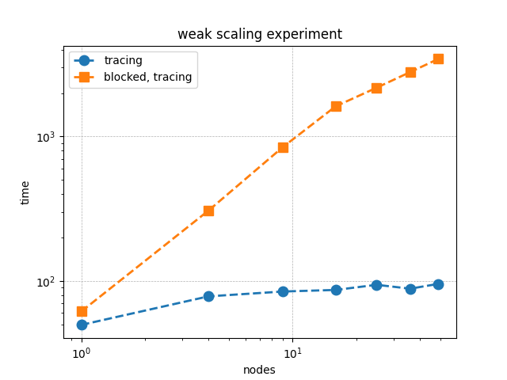

Performance Effect of `get()` Outside of a Task
++++++++++++++++++++++++++++++++++++++++++++++++++++++

This is a weak scaling plot of
Red-Black Gauss-Seidel iteration for Poisson's Equation in 2D.
The green squares are the weak scaling results when `get()` is used outside of a task.
Already at fifty nodes there is a 30X performance difference.  This blocked solution time
scales as :math:`\left(\texttt{nodes}\right)^{0.7}`.  So this difference will only get worse.

Forcing Bulk-Synchronousity in Your Code
++++++++++++++++++++++++++++++++++++++++

.. note:: 
  All FleCSI programs have a top-level task (TLT) from which all FleCSI tasks are launched.  
  The TLT is all the code that is run outside of a task.  Simply put, if
  the code launches any tasks, e.g., ``flecsi::execute<task::...>(...)``, it is
  the TLT.

.. note::
  Any blocking of the code in the TLT (like waiting on the result of `get()`)
  prevents any other tasks to be queued up for the runtime.  This blocking forces bulk synchronous computation.

This is exactly what we have done when we call ``get()`` on the
``residual`` future below.

.. code-block:: c++
  :caption: Forced bulk-synchronousity anti-pattern

  using namespace flecsi;

  std::size_t sub{3};
  std::size_t ita{0};

  static exec::trace t;         // trace object
  t.skip();                     // skip tracing first time through loop

  do {
    auto g = t.make_guard();    // turn tracing on for enclosing do loop
    for(std::size_t i{0}; i < sub; ++i) {
      execute<task::red>(m, ud(m), fd(m));
      execute<task::black>(m, ud(m), fd(m));
    }
    ita += sub;

   execute<task::discrete_operator>(m, ud(m), Aud(m));
   auto residual = reduce<task::diff, exec::fold::sum>(m, fd(m), Aud(m));
   err = std::sqrt(residual.get());
   flog(info) << "residual: " << err << " (" << ita << " iterations)"
              << std::endl;

  } while(ita < max_iterations.value());

Removing Bulk-Synchronousity from Your Code
+++++++++++++++++++++++++++++++++++++++++++

Here we pass the future to the `print_residual` task.  Calling `get()` inside
a task is correct as it allows the runtime to continue with other tasks while
`print_residual` is waiting on the reduction.

.. code-block:: c++
  :caption: Red-Black Gauss-Seidel non-blocking, no tracing

  using namespace flecsi;

  std::size_t sub{3};
  std::size_t ita{0};

  static exec::trace t;         // trace object
  t.skip();                     // skip tracing first time through loop

  do {
    auto g = t.make_guard();    // turn tracing on for enclosing do loop
    for(std::size_t i{0}; i < sub; ++i) {
      execute<task::red>(m, ud(m), fd(m));
      execute<task::black>(m, ud(m), fd(m));
    }
    ita += sub;

    execute<task::discrete_operator>(m, ud(m), Aud(m));
    auto residual = reduce<task::diff, exec::fold::sum>(m, fd(m), Aud(m));
    execute<task::print_residual>(residual, ita+sub);

  } while(ita < max_iterations.value());

.. note:: 
  Residual tolerance termination conditions are usually employed for solvers, but
  FleCSI does not yet support futures in this way.

.. code-block:: c++
  :caption: `print_residual` task

  void task::print_residual(future<double> residual, std::size_t ita) {
    double err = std::sqrt(residual.get());
    std::cout << "residual: " << err << " (" << ita << " iterations)"
      << std::endl << std::flush;
  }

When to Call `get()` Outside of a Task
++++++++++++++++++++++++++++++++++++++++++++++++++++++

Basically, never call `get()` outside of a task.
If you are using it in initialization once, that probably won't hurt much.
