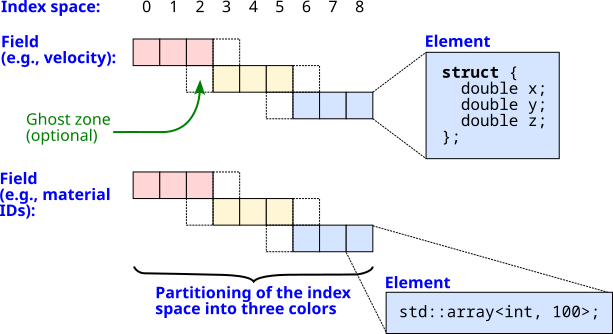
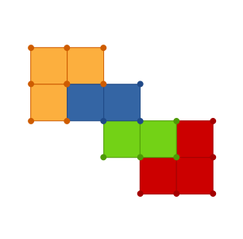
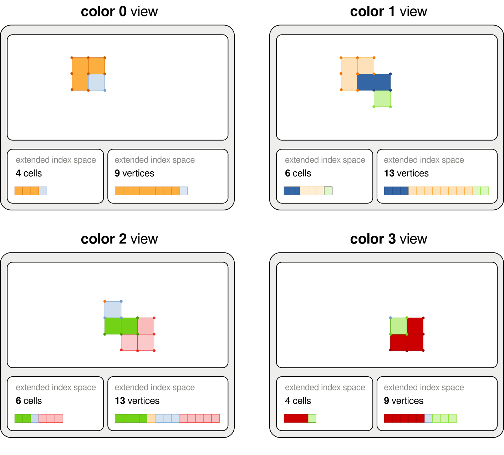
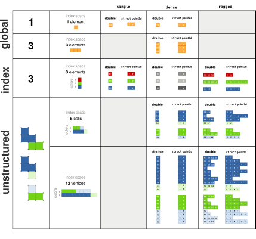
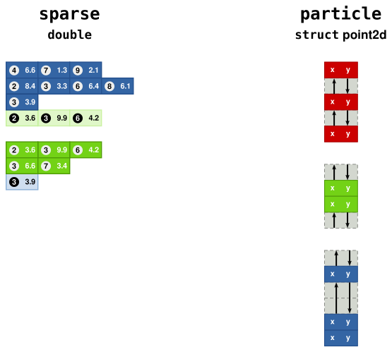

************************************************************************
Data Model
************************************************************************

To track dependencies among tasks and move data to the correct memory space for each, FleCSI requires detailed information about the data accessed by each task.
It therefore provides several types with which clients can define, create, and access that data.

This section begins with a brief overview of the important concepts: as they interact with each other, a detailed discussion cannot completely separate them out.
This will be
followed by a deeper dive into each topic.

Important Concepts
========================================================================

**Index Spaces**
    An *index space* is an enumeration of all entities of one kind (such as cells, nodes, or particles) in a computational domain.
    Each entity in an index space is labeled with an *index point*.

**Colors**
    Each index space is partitioned into a number of *colors* that can be processed in parallel.
    A color is not strictly bound to the memory space of a particular process (MPI rank), but can be
    relocated by the task-based parallelism machinery depending on the
    needs of the application.

**Fields**
    A *field* defines a variable over a particular index
    space, such as the mass in a cell (or a list per material) or the momentum vector of a
    particle.
    It provides the information necessary to manage the memory for that variable.

   Schematic of two fields on an index space

Index Spaces
============
Conceptually, an index space is a single collection of the entities in the problem across all colors.
However, the data is not only distributed but (for many computational methods) duplicated in part in the form of :ref:`ghost elements <ghost-elements>`, so there is no "global ID" used to access it.

Each color of an index space is presented as a one-dimensional array which includes any ghosts as well as the color's owned data.
As a point task has access to only one color at a time, an index point is just an ordinary index into this array.

Colors
========================================================================
Following Legion, FleCSI refers to simulation subdomains, each processed by a single C++ function call at a time, as *colors*.
The data for a subdomain is not owned by a process (an MPI rank) but can be
relocated depending on the needs of the simulation.
Moreover, with the Legion backend their number is not required to match the number of processes:

* You may know that some regions of your simulation domain will unpredictably be more
  expensive to compute.  In this case, one processor will take a long
  time to compute a single "expensive" color, while other processors
  finish their work quickly and wait for the next task.  In this case,
  you may want to create additional colors so that some processors can handle multiple "inexpensive" blocks.

* You may have multiple physics packages that can run in parallel, such
  as a hydrodynamics solver and an energy source.  In that situation you
  could use fewer colors than processes so that some processes can perform calculations for the hydrodynamics while others perform calculations for the energy source.

   An unstructured mesh topology instance with 4 colors.

.. _ghost-elements:

Ghost Elements
------------------------------------------------------------------------

Field values can be communicated between colors via ghost elements.

* A *ghost element* is an index point that belongs to another color, but
  a copy is provided to the current color.  An example would be the use
  of ghost cells in stencil-based codes so that each cell can read its
  neighbors' values and compute gradients.
  Typical usage does not involve writing to ghosts.

* An index point that belongs to the current color but could be copied
  to be a ghost element of another color is called a *shared element*.

* Any index points belonging to the current color that are never copied
  to be ghost elements are known as *exclusive elements*.

The read/write permissions of :ref:`accessors <field-accessors>`
may distinguish between these three varieties of index points in order
to expose additional opportunities for parallelization.

   Index spaces with ghost elements as seen by each color of a
   topology instance.

.. _fields:

Fields
========================================================================

A field defines a variable associated with an index space.
Only tasks can access the actual data.

Registration
------------------------------------------------------------------------

Index spaces are organized into :doc:`topologies <topologies>`; variables are defined on an index space by registering fields on its topology.
The tag type used for the registration (and other purposes to be discussed) is a *specialization*.
Supposing we have a specialization ``topo_t``, we can write

.. code-block:: cpp

  const flecsi::field<double>::definition<topo_t, topo_t::cells> mass_field;
  const flecsi::field<double>::definition<topo_t, topo_t::faces> massflux_field;

The ``mass_field`` variable declaration states that the ``topo_t`` specialization has a mass in each cell.
The ``massflux_field`` variable declaration states that ``topo_t`` has a mass flux on each face.

If you have multiple fields on the same index space, you can declare
them in a way that's analogous to a struct of arrays or in a way that's
analogous to an array of structs.  In a hydrodynamics code, the
conserved variables in your cells would include both mass and energy, so
you can declare these fields in two different ways.  To get a
struct-of-arrays data structure, you would declare

.. code-block:: cpp

  const flecsi::field<double>::definition<topo_t, topo_t::cells> mass_field;
  const flecsi::field<double>::definition<topo_t, topo_t::cells> energy_field;

To get an array-of-structs data structure, you would instead declare

.. code-block:: cpp

  struct cell_data_t {
    double mass;
    double energy;
  };
  const flecsi::field<cell_data_t>::definition<topo_t, topo_t::cells> cell_field;

The struct-of-arrays approach would allow you to access the mass field without also having to access the energy field (at the potential cost of additional dependency analysis overhead), but in the array-of-structs approach you are allocating storage for ``cell_data_t`` structs so you cannot access the mass without also accessing the energy.
The usual concerns about cache utilization and vectorizability must also be considered.

When you have a vector quantity, you have extra options.
Continuing with the example of hydrodynamics, you also have a momentum variable in each cell, and
momentum is a three-dimensional vector.  To get a struct-of-arrays
approach, you could declare each component independently as

.. code-block:: cpp

  const flecsi::field<double>::definition<topo_t, topo_t::cells> momentum0_field;
  const flecsi::field<double>::definition<topo_t, topo_t::cells> momentum1_field;
  const flecsi::field<double>::definition<topo_t, topo_t::cells> momentum2_field;

or you could simply declare

.. code-block:: cpp

  const flecsi::field<double>::definition<topo_t, topo_t::cells> momentum_fields[3];

In both cases, you get a struct-of-arrays data structure and the
different momentum fields can be allocated independently of each other.
If you want an array-of-structs approach, you could declare

.. code-block:: cpp

  struct momenta_t {
    double x;
    double y;
    double z;
  };
  const flecsi::field<momenta_t>::definition<topo_t, topo_t::cells> momentum_field;

.. _layouts:

Layouts
-------

Each field has one of several pre-defined layouts, which specifies how field elements (of type ``T``) relate to index points:

* The ``single`` layout stores one ``T`` for each color.  For example,
  if you have physics operators that only apply in certain regions of
  space, you could using the ``single`` layout to store a flag
  indicating if a given color needs to execute that physics operator.
  Accessing the one element does not require specifying an index point, since there is only one for a color.

* The ``dense`` layout stores one ``T`` for each index point.  This is a
  very common layout, used when every cell or particle has a value for
  that field, such as mass in a cell or energy of a particle.

* The ``ragged`` layout stores a resizable array of ``T`` for each index
  point.  It can be thought of as analogous to having a
  ``std::vector<T>`` for each index point.  This could be used to store
  a list of materials present in a given cell when not every cell has
  every material and the materials can move to different cells over
  time.

* The ``sparse`` layout can be thought of in several ways, depending on
  what is most useful:

  * A ``sparse`` layout can be thought of as similar to the ``ragged``
    layout, but without the requirement that every element in the array
    must exist.  That is, the fact that element 5 exists does not imply
    that elements 0 through 4 also exist.  This allows memory savings if
    there are large gaps where ``ragged`` would allocate memory that is
    not needed.

  * Alternately, a ``sparse`` layout can be thought of as analogous to a
    ``std::map<std::size_t,T>`` for each index point.  This is closer to
    the actual implementation.

  An example where this might be useful is to track the masses of
  different materials when not every cell must contain every material
  but you want the same index to always refer to the same material.

* The ``particle`` layout stores an unordered set of ``T`` for each
  color; the index points are simply arbitrary ids for the particles.

The field registration examples above use the ``dense`` layout by default.
Other layouts are chosen with syntax like ``flecsi::field<double, flecsi::data::ragged>``.

   Illustration of the single, dense and ragged layout for various index spaces and data types.

   Fields in sparse and particle layouts.

References
----------
Fields are registered on specializations as a whole; every instance of the associated topology type has the field.
It is therefore as if a member were added to a C++ struct: one might imagine defining ``mass_field`` on the specialization ``topo_t``, creating an instance from it called ``grid``, and writing ``grid.mass_field``.
However, the language does not actually allow extending a type.
Instead, the
field objects themselves become tools to extract the field data, so you
would get the mass field from ``grid`` by calling ``mass_field(grid)``.
This expression produces a *field reference* which can be passed as an argument to a task that uses the field.

.. sidebar:: Memory Allocation

  If multiple instances of a topology type exist, each allocates memory only for the fields that are actually accessed on that instance.

.. _field-accessors:

Accessors
------------------------------------------------------------------------

A task accepts field references as arguments for special function parameters called *accessors*.
When the task is launched, memory for the fields is allocated if necessary and is provided to the task via the accessors.
Accessors also encode the privileges for each task, which are used by the task
model to determine the order in which tasks may be executed.  For
example, two tasks that access the same field have to be serialized if
they both have read and write permissions for that field, but two tasks
with read-only access to the same field can run in parallel.

The available privileges are

* ``na`` -- no access

* ``ro`` -- read-only

* ``wo`` -- write-only

* ``rw`` -- read-write

The same ``field`` type that registers a field also specifies accessors for it: a typical accessor for updating a dense field would have the type ``flecsi::field<double>::accessor<flecsi::rw>``.

Topologies with :ref:`ghosts <ghost-elements>` also use privileges to determine when copies are required to give a task access to updated ghost data.
In this case multiple privileges are specified to describe access to exclusive, shared, and/or ghost elements.
If no privilege grants write permission (*e.g.*, with ``flecsi::field<double>::accessor<flecsi::ro, flecsi::ro, flecsi::na>``), the accessor will produce the ``const``-qualified version of the field type.
However, it is impossible to so restrict some but not all index points (for, say, ``flecsi::field<double>::accessor<flecsi::rw, flecsi::ro, flecsi::ro>``); if the client modifies elements for which it has no write permission, the behavior is undefined.

A ghost copy occurs between any two tasks that operate on the same field where

1. the first has write access to the shared elements,

2. the second has read access to the ghost elements, and

3. neither the first nor any intervening task has write access to the ghost elements.

That is, ghosts are considered out of date only if the shared values have been written *more* recently; this allows ghosts to be initialized to a constant or to be transformed by a local function without communication.
Two writes to the shared elements of a field may produce only one ghost copy if no ghost reads occur after the first but not after the second.

The first access to each field must be write-only, except that the ghosts may be no-access to indicate that the initial values need to be copied to other colors as usual.

Mutators
------------------------------------------------------------------------

An accessor can read or write the values in a field but cannot add or remove them.
Layouts that support those operations provide *mutators* for the purpose:

* A ``ragged`` mutator provides an interface at each index point based on ``std::vector``.
* A ``sparse`` mutator provides an interface at each index point based on ``std::map``.
* A ``particle`` mutator provides an interface based on C++'s proposed ``std::hive`` for efficient insertion and deletion of field values.

Just like an accessor, a mutator corresponds to a field reference argument and has privileges.
The first access to a field with any of these layouts must use a write-only mutator to initialize it to the appropriate empty state.

Memory
^^^^^^
Every layout that has a mutator has a maximum number of elements that can be stored.
This limit can be changed, but not during a task, so it must be chosen by the client as a compromise between memory usage (and sometimes communication overhead) and the probability of process failure due to buffer exhaustion.
For the ``particle`` layout, this maximum is simply the size of the index space.
For the ``ragged`` and ``sparse`` layouts, this maximum is shared among all the index points and must be set separately.
(It might even be smaller than the index space if most index points are expected to have 0 elements.)

Field references for ``ragged`` or ``sparse`` fields provide a ``get_elements`` member function that provides access to the topology component that stores elements.
The object returned can be used to allocate memory manually (with ``resize``) or automatically based on a heuristic (with ``growth``).

The current implementation of memory management for these layouts imposes several limitations.
First, the automatic memory allocation is incompatible with :ref:`tracing`, so ``ragged`` and ``sparse`` mutators cannot be used in a task launched during a trace.
Ghost copies for these layouts are implemented using mutators, so they are excluded from traces as well.
Moreover, they use further temporary allocations during a task that are incompatible with GPU execution, so they cannot be used in a ``toc`` task.

.. _multi-accessors:

Multi-color accessors
---------------------
In addition to ghost elements, the Legion backend provides *launch maps* as another mechanism for accessing another color's data in a point task.
They explicitly nominate one or more colors to be processed by each point task, so they can permute colors as well as duplicating them (for read-only access) or omitting them.
Accessors, mutators, or topology accessors (discussed later) can be wrapped in a ``data::multi`` task parameter; the launch map takes the place of the underlying topology in the task argument (*e.g.*, in forming a field reference).
A task can accept multiple multi-color accessors as well as ordinary accessors (relative to which any permutation is meaningful).

.. note::

  Other backends support only trivial launch maps that nominate the usual color for a point task or none at all.
