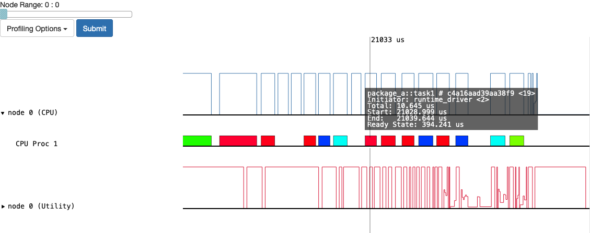

Profiling with Legion
=====================

Building FleCSI with the Legion backend adds an additional set of tools for
profiling your application. See Legion's `Performance Profiling and Tuning
<https://legion.stanford.edu/profiling/index.html>`_ page for a detailed list
of tools and their available options.

The following describes how to use Legion Prof to generate a simple profile:

Here we create a profile of the ``flecsi/run/cycle`` test. We use the
``--backend-args`` option to pass command-line options to the Legion backend. In
this case, the option to enable profiling for 1 processor and how to call the
profiling log file(s).

.. code-block:: console

   $ ./flecsi/run/cycle --backend-args="-lg:prof 1 -lg:prof_logfile prof_%.gz"

After the application completes, the generated profiling log files need to be
passed on to ``legion_prof.py``:

.. code-block:: console

   $ legion_prof.py prof_*.gz
   Reading log file prof_0.gz...
   parsing prof_0.gz
   Matched 826 objects
   Generating interactive visualization files in directory legion_prof
   emitting utilization
   elapsed: 0.11297273635864258s

This produces a new folder called ``legion_prof`` containing a visualization.
These files need to be hosted by a local webserver to be viewed. One of the
simplest ways of achieving this is by using Python's embeded HTTP server:

.. code-block:: console

   $ cd legion_prof
   $ python3 -m http.server

This will host the Legion Prof GUI on your local system at
`http://localhost:8000 <http://localhost:8000>`_.

   Screenshot of Legion Prof GUI for cycle test

Please see the `Performance Profiling and Tuning
<https://legion.stanford.edu/profiling/index.html>`_ page for further details
on how to use the GUI.

.. note::

   FleCSI shortens the registered task names to ``function_name # <HASH>`` when
   passing them to Legion.  The matching full function signatures can be obtained
   through console output when using the ``task_names`` FLOG tag.

   Here is the corresponding FLOG output for the cycle test, which shows the
   matching task name for task selected in the above screenshot.

   .. code-block:: console
      :emphasize-lines: 12-13

       $ ./flecsi/run/cycle --flog-tags="task_names"
       [info task_names p0 t22423465937280]
       Registering task "flecsi::flog::state::gather # aa152dae82f8075": flecsi::flog::state::gather(flecsi::flog::state&)
       [info task_names p0 t22423465937280]
       Registering task "flecsi::data::launch::claims::fill # 70edb28d0eab812a": flecsi::data::launch::claims::fill(flecsi::data::accessor<single, unsigned long, 6u>, std::vector<unsigned long, std::allocator<unsigned long> > const&)
       [info task_names p0 t22423465937280]
       Registering task "flecsi::data::leg::mirror::fill # ad6d0ac86bafa94e": flecsi::data::leg::mirror::fill(flecsi::data::accessor<dense, Realm::Rect<2, long long>, 6u>, unsigned long)
       [info task_names p0 t22423465937280]
       Registering task "flecsi::data::leg::mirror::extend # 5894dedd432085e1": flecsi::data::leg::mirror::extend(flecsi::data::accessor<single, unsigned long, 5u>, flecsi::data::accessor<dense, Realm::Rect<2, long long>, 6u>, unsigned long)
       [info task_names p0 t22423465937280]
       Registering task "flecsi::topo::repartition::fill<flecsi::exec::partial<flecsi::topo::zero::function(unsigned long)> > # 87c228c62d22e85": void flecsi::topo::repartition::fill<flecsi::exec::partial<flecsi::topo::zero::function(unsigned long)> >(flecsi::data::accessor<single, unsigned long, 6u>, flecsi::exec::partial<flecsi::topo::zero::function(unsigned long)>)
       [info task_names p0 t22423465937280]
       Registering task "package_a::task1 # c4a16aad39aa38f9": package_a::task1()
       [info task_names p0 t22423465937280]
       Registering task "package_a::task2 # b74688b67b9bef74": package_a::task2()
       [info task_names p0 t22423465937280]
       Registering task "package_a::subcycle_task # 4b1b91905f6a4066": package_a::subcycle_task()
       [info task_names p0 t22423465937280]
       Registering task "package_a::task3 # 4610615862f4ba54": package_a::task3()
       [info task_names p0 t22423465937280]
       Registering task "package_a::task4 # 252b076a8768514b": package_a::task4()
       [info task_names p0 t22423465937280]
       Registering task "package_b::subcycle_task # 1e864126eab03245": package_b::subcycle_task()
