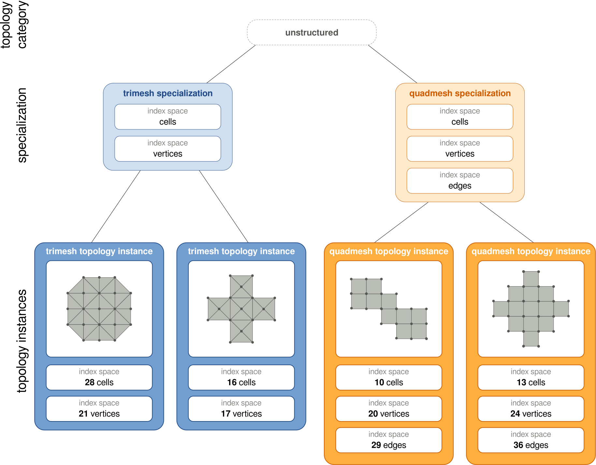
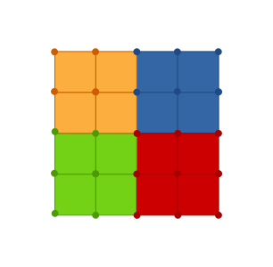
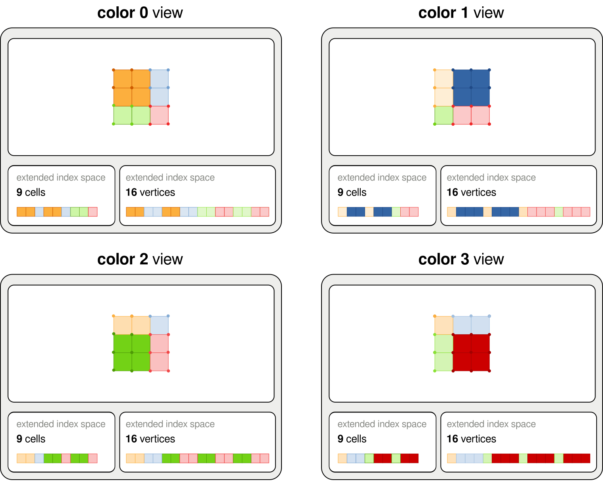
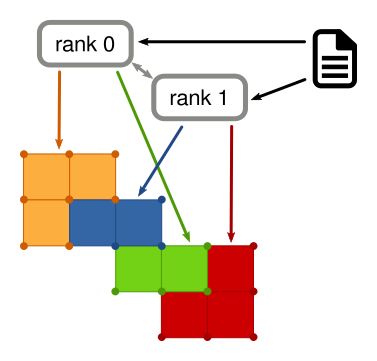

Topologies
**********
This section describes the common behavior of FleCSI topologies as well as providing a brief survey of the types available.

Terminology
+++++++++++
**Topologies**
    A *topology* is a collection of index spaces that represent a computational domain like a mesh or a layout of particles in space.
    (Fields on some of these index spaces express physical quantities; others contain structural information describing the domain itself.)
    An application can use multiple topologies of the same or different types, serially or simultaneously.
    Sometimes the word "topology" refers to one of these *types* rather than to a specific instance of it.

**Topology Categories**
    FleCSI provides infrastructural components for several categories of topology, such as ``unstructured`` or ``ntree``.
    Each topology type is defined in terms of one such category; clients cannot define their own.

**Specializations**
    A *specialization* is a customization of a topology category to create
    an interface that allows domain experts to implement operations on
    top of the topology.  The relevant operations will depend strongly
    on the needs of the domain experts, but will often include queries
    about the physical layout of points within the simulation space.
    For example, a specialization of the ``unstructured`` topology category for a two-dimensional mesh might define it in terms of vertices, edges, and elements but not faces.
    In fact, every topology type is associated with such a specialization; the term "specialization" emphasizes the definition rather than the resulting type to be used.

   Two specializations of the unstructured topology category with different number of index spaces and multiple topology instances.

Index Spaces
++++++++++++
Just as "topology" can refer to a type or an instance of that type, the term "index space" can refer not only to the (say) 42 cells of a particular mesh but also to the choice between "cells" and "nodes" as the domain for a field (that might exist on multiple meshes).
The names that describe these index-space "kinds" are chosen by the specialization.

An index space has no concept of relationships between different index
points in the same index space.  For example, nothing in the definition
of the index space specifies which entities are spatially adjacent to
which other entities.  This information would be encoded in the
specialization (sometimes with support from the underlying topology).
When these relationships cross colors (as for the specification of ghost copies), a two-dimensional index point is used whose first component is the color number.

Different index spaces also have no knowledge of how they relate to each
other.
A set of faces might define the boundary of a cell
but the index spaces alone have no ability to know that, or to map from
a cell to the list of faces that surround it.  This information would be
encoded in the specialization.

Provided Topologies
+++++++++++++++++++
Topology categories provide only generic interfaces, some more generic than others.
These interfaces are meant to be used to create :doc:`specializations <specializations>` that are suitable for direct use by application developers.

A few topology categories are so simple that FleCSI provides a single specialization rather than a generic interface to be specialized:

* The ``global`` topology is the most basic topology provided by FleCSI.
  It has a single index space of configurable size; uniquely, it is not partitioned between colors and does not support ``ragged`` or ``sparse`` fields.
  The field values of the ``global`` topology can be written to by a
  single task at a time, or can be read by every task in a parallel
  launch.  This topology will typically be used for global configuration
  data (for example, whether the current simulation is 1D, 2D, or 3D).

* The ``index`` topology is the next most basic topology provided by
  FleCSI.
  It also has a single index space of configurable size.
  Each index point is assigned to a separate color, so the ``single`` layout is typical (although a variable amount of data can still be stored with ``ragged`` or ``sparse`` instead).
  The ``index`` topology could be used to store per-color integral quantities or to turn on or
  off physics packages that are only run in subsets of the domain (e.g.,
  this color needs to run hydrodynamics but there are no energy
  sources).

The normal topology categories do require a specialization:

* The ``user`` topology still provides but a single index space, but it has a size on each color that can be set at construction and changed later.
  The specialization serves merely as a tag to distinguish multiple clients.
  No ghost copies are supported.

* The ``narray`` topology comprises a set of multidimensional arrays, with each axis divided into a number of intervals to form a Cartesian product of colors.
  It includes special support for representing a structured mesh where access to neighboring entities is by computed index.
  It includes features to help build faces, edges, and vertices
  (referring to them collectively as "auxiliaries").  It also helps
  manage communication across colors through ghost cells, and boundary
  conditions through boundary cells.

* The ``ntree`` topology is designed to support particles and to
  efficiently find neighboring particles.  It uses a hashed binary tree,
  quadtree, or octree in one, two, or three dimensions respectively.
  The ``ntree`` topology is useful for particle-based methods such as
  smoothed-particle hydrodynamics.

* The ``unstructured`` topology comprises an arbitrary set of index spaces along with several kinds of graph adjacency information that support use as an unstructured mesh.
  The index spaces can be resized to support mesh refinement.

   An narray-based mesh topology instance with 4 colors.

   Index spaces in an narray-based topology with ghost elements as seen by each
   color of a topology instance. It illustrates how owned and ghost elements are
   interleaved due to how they are stored in one-dimensional arrays.

Colorings
+++++++++
A coloring is the layout information required to construct a topology instance, so called because it generally identifies which color owns each index point.
As a trivial example, the ``global`` and ``index`` topologies can use just an integer as a coloring:

.. code-block:: cpp

  using namespace flecsi;

  int simulation(scheduler &s) {
    topo::global::topology pair(s, 2);
    topo::index::topology hydro_indices(s, 42);
    // ...
  }

Note the different interpretations of the sizes: ``pair`` doesn't have colors and holds 2 field values, while ``hydro_indices`` has 42 colors with one field value each.

Note also that the lifetime of topology instances must be limited to the control model execution (achieved here by making them local variables).

While the coloring type depends on the topology category and not the specialization, specializations for non-trivial topologies typically assist the application in constructing one.
In simple cases, the result looks like

.. code-block:: cpp

  int simulation(scheduler &s) {
    canon::topology mesh(s, canon::mpi_coloring(s, "test.txt"));
    // ...
  }

which asks the ``canon`` specialization to interpret the *test.txt* file as a coloring for its topology category (perhaps ``unstructured``).
The name ``mpi_coloring`` serves as a reminder that this procedure is launched as an MPI task, as is often required for it to perform collective I/O or distribute data.

   A mesh file loaded by 2 MPI ranks that divide it into 4 colors.

.. vim: set tabstop=2 shiftwidth=2 expandtab fo=cqt tw=72 :
