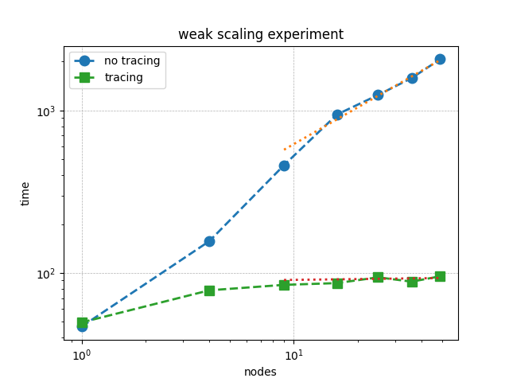

Performance Effect of Tracing
++++++++++++++++++++++++++++++++++++

The performance affect of using tracing cannot be overstated.

This is a weak scaling plot of
Red-Black Gauss-Seidel iteration for Poisson's Equation in 2D.
The blue circles are the weak scaling results without tracing and green squares are with tracing.
Already at fifty nodes there is a 20X performance difference.  The solution time
without tracing scales as :math:`\left(\texttt{nodes}\right)^{0.7}`.  So this difference will only get worse.

Implementing Tracing in Your Code
++++++++++++++++++++++++++++++++++++

Here is the iteration loop without tracing.

.. code-block:: c++
  :caption: Red-Black Gauss-Seidel non-blocking, no tracing

  using namespace flecsi;

  std::size_t sub{3};
  std::size_t ita{0};

  do {
    for(std::size_t i{0}; i < sub; ++i) {
      execute<task::red>(m, ud(m), fd(m));
      execute<task::black>(m, ud(m), fd(m));
    }
    ita += sub;

    execute<task::discrete_operator>(m, ud(m), Aud(m));
    auto residual = reduce<task::diff, exec::fold::sum>(m, fd(m), Aud(m));
    execute<task::print_residual>(residual, ita+sub);

  } while(ita < max_iterations.value());

.. note:: 
  Residual tolerance termination conditions are usually employed for solvers, but
  FleCSI does not yet support futures in this way.

.. note:: 
  These loops contain `flecsi::execute<>` task launches. Any such loops in your code
  need to have tracing enabled either on the loop itself or on a containing loop.

.. code-block:: c++
  :caption: Red-Black Gauss-Seidel non-blocking, no tracing

  using namespace flecsi;

  std::size_t sub{3};
  std::size_t ita{0};

  static exec::trace t;         // trace object
  t.skip();                     // skip tracing first time through loop

  do {
    auto g = t.make_guard();    // turn tracing on for enclosing do loop
    for(std::size_t i{0}; i < sub; ++i) {
      execute<task::red>(m, ud(m), fd(m));
      execute<task::black>(m, ud(m), fd(m));
    }
    ita += sub;

    execute<task::discrete_operator>(m, ud(m), Aud(m));
    auto residual = reduce<task::diff, exec::fold::sum>(m, fd(m), Aud(m));
    execute<task::print_residual>(residual, ita+sub);

  } while(ita < max_iterations.value());

.. note:: 
  The first time through this loop, `task::red` follows
  initialization tasks.  This can setup a different ghost copy pattern
  than all other iterations.  Tracing works by replaying memoized dependency analysis
  computations.  The `t.skip()` command tells FleCSI to defer tracing
  until the second iteration of the `do` loop.

Enabling Trace Replay on the Command Line
+++++++++++++++++++++++++++++++++++++++++

Tracing memoization must also be enabled on the command line.

.. code-block:: console

  $ srun ... poisson ... --backend-args="... -dm:memoize"

When to Use Tracing
+++++++++++++++++++++++++++++++++++++++++

You should enable tracing anytime you have a set of tasks that will be `flecsi::execute<>`'ed in the same sequence over and over again.
