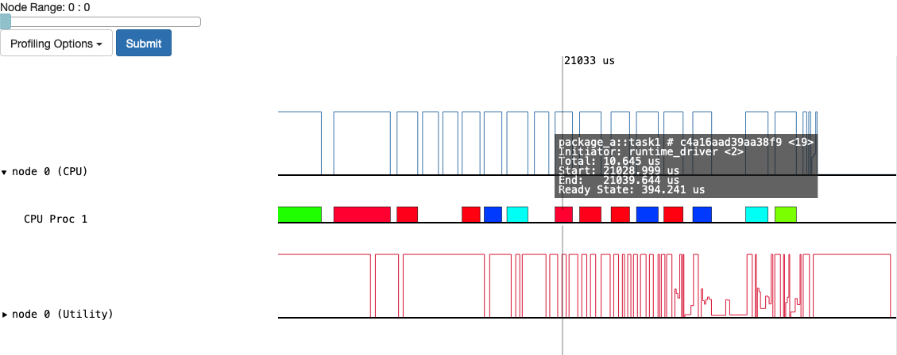
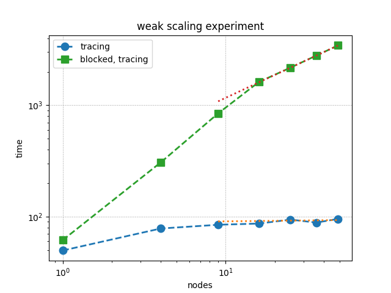
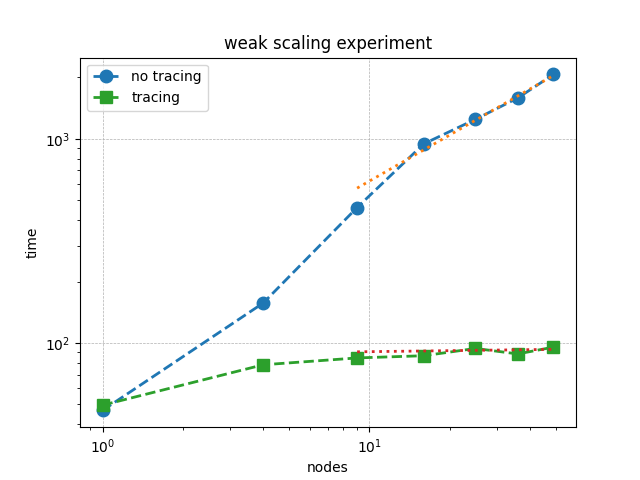

Performance
***********

This section provides insights into performance concerns in FleCSI applications.

Profiling
+++++++++

Before attempting to improve performance it must be analyzed.
Note that in addition to the standard generic tools (*e.g.*, ``perf`` for CPU code), Legion provides a `built-in profiler <https://legion.stanford.edu/profiling/>`_ (enabled via ``run::config::legion`` or ``LEGION_DEFAULT_ARGS`` in the environment).

   Screenshot of Legion Prof GUI for cycle test

.. note::

   FleCSI shortens the registered task names to :samp:`function_name # {hash}` when
   passing them to Legion.  The matching full function signatures can be obtained
   via ``flecsi::task_names``, which returns a mapping of the shortened function
   signature to its full signature.

Futures
+++++++

As explained in the :ref:`future` section, performance can be negatively impacted when ``get`` or ``wait`` is called outside of a task.
Doing so introduces a synchronization point that blocks the execution flow until the future is resolved, effectively serializing the runtime.

This issue becomes particularly significant in scalable iterative algorithms.
For example, the following weak scaling plot shows the performance of a Red-Black Gauss-Seidel iteration for solving Poisson’s equation in 2D.
The green squares represent runs where ``get`` is used outside of tasks.
Already at fifty nodes, performance drops by a factor of 30.
The solution time with ``get`` scales roughly as :math:`(\texttt{nodes})^{0.7}`.

The following example illustrates this bottleneck, where ``get`` is called outside a task:

.. code-block:: c++
  :caption: Forced bulk-synchronous anti-pattern

  using namespace flecsi;

  auto residual = s.reduce<task::diff, exec::fold::sum>(/* ... */);
  err = std::sqrt(residual.get());
  flog(info) << "residual: " << err << std::endl;

A more efficient pattern is to defer the call to ``get`` into a task itself.
This keeps the control flow non-blocking and allows the runtime to overlap communication and computation:

.. code-block:: c++
  :caption: Red-Black Gauss-Seidel non-blocking

  using namespace flecsi;

  auto residual = s.reduce<task::diff, exec::fold::sum>(/* ... */);
  s.execute<task::print_residual>(residual);

  /* ... */

  void task::print_residual(future<double> residual) noexcept {
    double err = std::sqrt(residual.get());
    std::cout << "residual: " << err << std::endl;
  }

The key takeaway is to avoid calling ``get`` outside of tasks during iterative execution.
While such blocking may be acceptable during initialization or finalization, it should be avoided in performance-critical loops.

Tracing
+++++++

As discussed in the :ref:`tracing` section, the Legion backend can dramatically reduce overhead by tracing task dependencies during repeated execution patterns.
This is particularly important when tasks are launched on the same fields in regular loops, such as in time-stepping or iterative solvers.

The following weak scaling plot compares traced and untraced execution of Red-Black Gauss-Seidel in 2D.
The blue circles show the performance without tracing, while the green squares represent traced runs.
At fifty nodes, tracing yields a 20× improvement.
The untraced solution time scales approximately as :math:`(\texttt{nodes})^{0.7}`, and this performance gap increases with scale.

Below presents a proper implementation of the tracing:

.. code-block:: c++
  :caption: Red-Black Gauss-Seidel loop with tracing

  using namespace flecsi;

  std::size_t sub{3};
  std::size_t ita{0};

  static exec::trace t;
  t.skip(); // skip tracing first iteration

  do {
    auto g = t.make_guard();
    for(std::size_t i{0}; i < sub; ++i) {
      s.execute<task::red>(m, ud(m), fd(m));
      s.execute<task::black>(m, ud(m), fd(m));
    }
    ita += sub;

    s.execute<task::discrete_operator>(m, ud(m), Aud(m));
    auto residual = s.reduce<task::diff, exec::fold::sum>(m, fd(m), Aud(m));
    s.execute<task::print_residual>(residual, ita + sub);

  } while(ita < max_iterations.value());

In other trials using Legion in Release mode, tracing has been shown to all but completely eliminate any of the overhead from Legion's superlinear dynamic dependency analysis.
These experiments simply used 10ms sleeps in every task and passed varying number of fields for a varying number of task launches in each trial.
Without tracing, the asymptotic overhead time per task is approximately :math:`(560 ps)f^{2}w + (97 µs)f + (190 µs)` where f is the number of fields passed and w is legion's `window size`__.
This represents an upper bound on the cost of Legion's dependency analysis; note that with the default *w* the first term is the smallest for :math:`f<174`, so reducing *w* is likely to produce more inefficiency from stalls than it avoids from redundant checks.

__ https://legion.stanford.edu/profiling/#legion-runtime-performance-flags

Creating a trace in this case took 642 µs per field, and using it adds 50 µs (20%) to a task launch, but it reduces the task overhead per field by a factor of 32 to 3 µs.
It is thus a net improvement for even one field after 15 task launches and after 7 or 8 task launches for at least 4 fields.
